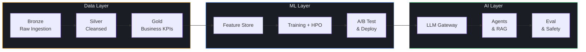

<div align="center">


### Hey, I'm Paul 👋

I build production AI systems — from data pipelines to autonomous agents.

Everything I ship is typed, tested, async-first, and built to run in prod.

</div>

---

### 🛠️ Tech I Work With

```python
class Stack:
    languages   = ["Python", "SQL", "TypeScript"]
    data        = ["Spark", "Delta Lake", "dbt", "Airflow"]
    ml          = ["MLflow", "PyTorch", "scikit-learn", "XGBoost"]
    llm         = ["OpenAI", "Anthropic", "LangChain", "RAG"]
    cloud       = ["Azure", "Databricks", "AWS"]
    infra       = ["Docker", "Terraform", "GitHub Actions"]
    principles  = ["Async-first", "Type-safe", "12-Factor", "Tested"]
```

---

### 🚀 What I've Built

<table>
<tr>
<td width="50%">

#### 🏭 Data & ML

**lakehouse-analytics-platform**\
Medallion ETL with data quality gates, DQ scoring, and IaC.\
`Spark` `Delta Lake` `Great Expectations` `Terraform`

**mlops-accelerator**\
Full MLOps lifecycle: HPO → A/B testing → canary deploy → drift monitoring.\
`MLflow` `Bayesian Stats` `FastAPI` `Prometheus`

**smart-docs**\
RAG from scratch — no LangChain. NumPy vector store, BM25+vector hybrid search, citations.\
`NumPy` `OpenAI` `BM25` `FastAPI`

**adaptive-ai-gateway**\
LLM proxy that cuts costs 60%: semantic cache, smart routing, prompt compression.\
`tiktoken` `OpenAI` `Anthropic` `asyncio`

</td>
<td width="50%">

#### 🤖 AI & Agents

**browser-autopilot**\
Autonomous browser agent. GPT-4o Vision reads screenshots, Playwright executes actions.\
`Playwright` `GPT-4o Vision` `asyncio` `Streamlit`

**ai-agent-toolkit**\
Multi-provider agent framework with RAG, guardrails, and prompt injection defense.\
`OpenAI` `Anthropic` `FAISS` `Pydantic`

**agentic-workflow-engine**\
DAG-based workflow orchestration with LLM steps, human-in-the-loop, and auto-rollback.\
`asyncio` `Kahn’s Algorithm` `OpenAI` `httpx`

**llm-eval-framework**\
Automated red-teaming, LLM-as-judge evaluation, and EU AI Act compliance reports.\
`Statistical Testing` `Jailbreak Detection` `Risk Scoring`

</td>
</tr>
</table>

---

### 🎯 Architecture I Care About



---

### 📊 GitHub Stats

<div align="center">


</div>

---

### 🧠 How I Think About Software

```python
class Philosophy:
    """
    Code is a liability, not an asset.
    Every line you write is a line you have to maintain.
    """
    build_for    = "production, not demos"
    test_like    = "it will break at 3am"
    document_for = "the person who replaces you"
    ship_when    = "it's tested, typed, and reviewed"
    delete_when  = "it no longer earns its complexity"
```

<div align="center">


</div>